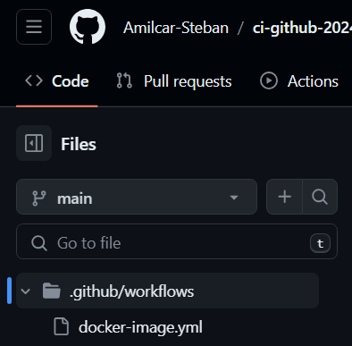
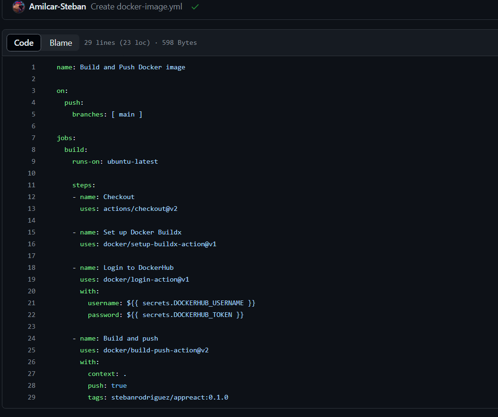
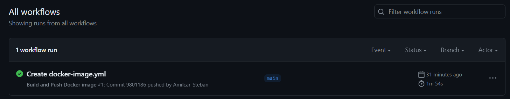
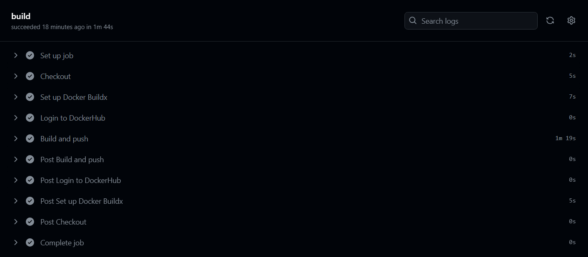

# Proyecto CI github-Actions

# Pasos:

# 1. Construir el dockerfile
En este paso, se construye una imagen de Docker utilizando el archivo Dockerfile. El Dockerfile contiene las instrucciones para crear un entorno de ejecución específico, en este caso vamos a crear una imagen de Node.js para ejecutar el código de la aplicación.

```Dockerfile
FROM node:latest
WORKDIR /app
COPY package*.json ./
RUN npm install
COPY . .
EXPOSE 3000
CMD ["npm", "run", "dev"]
```

# 2. Crear la GitHub Action:
Una GitHub Action es un flujo de trabajo automatizado que se ejecuta en respuesta a eventos específicos en tu repositorio de GitHub. En este caso, se está creando una acción para automatizar el proceso de construcción y empuje de la imagen de Docker y para esto vamos a usar un job y una serie de steps de ese job:



## Checkout

Esta acción se encarga de clonar el repositorio en el entorno de ejecución de la acción. Esto permite acceder a los archivos y directorios del repositorio durante la ejecución del flujo de trabajo.

## Docker set up buildx
Esta acción configura el entorno de Docker para utilizar la funcionalidad de buildx. Buildx es una herramienta que permite construir imágenes de Docker de forma más eficiente y con soporte para diferentes plataformas.

## Docker login 
### (Usar Secretos de GitHub para las credenciales del Docker login)
En este paso, se realiza el inicio de sesión en Docker utilizando las credenciales proporcionadas como secretos en GitHub. Los secretos son variables de entorno encriptadas que se utilizan para almacenar información sensible, para este paso se utiliza el secreto llamado DOCKER_USERNAME y DOCKER_PASSWORD creado en settings de GitHub -> Secrets.

## Docker Build and push
Esta acción se encarga de construir la imagen de Docker utilizando el Dockerfile y luego empujarla al registro de Docker especificado. El registro de Docker es un repositorio centralizado donde se almacenan y comparten las imágenes de Docker.

### El archivo docker-image.yml debería verse así despues de la creación de todos los pasos:



### Ahora se crea el commit y este actions se ejecuta, debería verse así:



### Vista desde los logs del actions:

